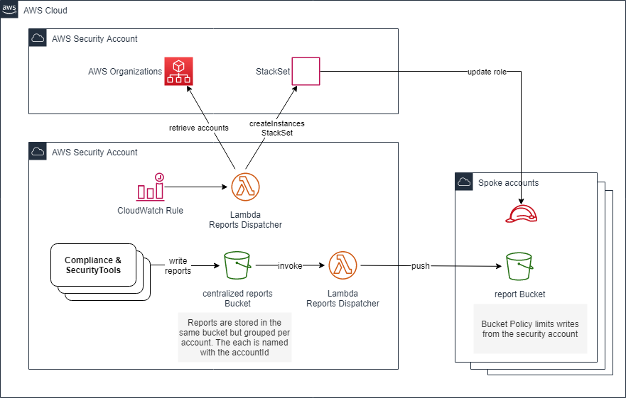

# Security Reporting

## Description

Implementing Security and Compliance tools in large companies gathers numbers challenges. One of them is to keep a centralized view of what is happening in the whole AWS Organizations and in the mean time sharing the sufficient level of information to operational teams to react.

[CloudSploit Batch](https://github.com/jcaffet/cloudsploit-batch), [Prowler Batch](https://github.com/jcaffet/prowler-batch), [Scoutsuite Batch](https://github.com/jcaffet/scoutsuite-batch) are some tools that write to a central bucket for Central Security teams. Adding Reports Dispatcher, all per-account reports are pushed in real-time to spoke accounts.

Security Reporting is a small tools which spreads files, usually reports, from a centralized DataLake to all the child accounts.

## Design

### Diagram

### Content

Reports Dispatcher simply industrializes the copy of centralized report files :
- S3 Bucket which stores the reports
- one triggered Lambda which copies the reports to a target spoke bucket

### Explanation

The system simply works as follow :
- SecurityReportingBucket : the S3 Bucket trigger a Lambda for each new file
- SecurityReportingDispatcherLambda : Lambda copies the object to a target spoke account depending on the source prefix
- SecurityReportingAccountHarversterLambda : this Lambda is in charge of updating the StackSet that manages the S3 bucket on spoke accounts. This Lambda is invoked by a CloudWatch rule but could be invoked manually.

## Installation

### Prerequisites

All spoke accounts must belong to the same AWS Organizations.

### Steps

1. deploy the [cf-securityreporting-spoke.yml](cf-securityreporting-spoke.yml) CloudFormation stack in each spoke account. Use StackSet to deploy on large number of accounts.
2. deploy the [cf-securityreporting-org-account.yml](cf-securityreporting-org-account.yml) in the account using AWS Organizations.
3. deploy the [cf-securityreporting-central.yml](cf-securityreporting-central.yml) in the central security account.

## How to use it

Copies are performed automatically. Nothing has to be done.

## Notes

The S3 spoke buckets are named thanks to a convention. In case of S3 Bucket name overlapping, add a suffix to ensure unique names.
